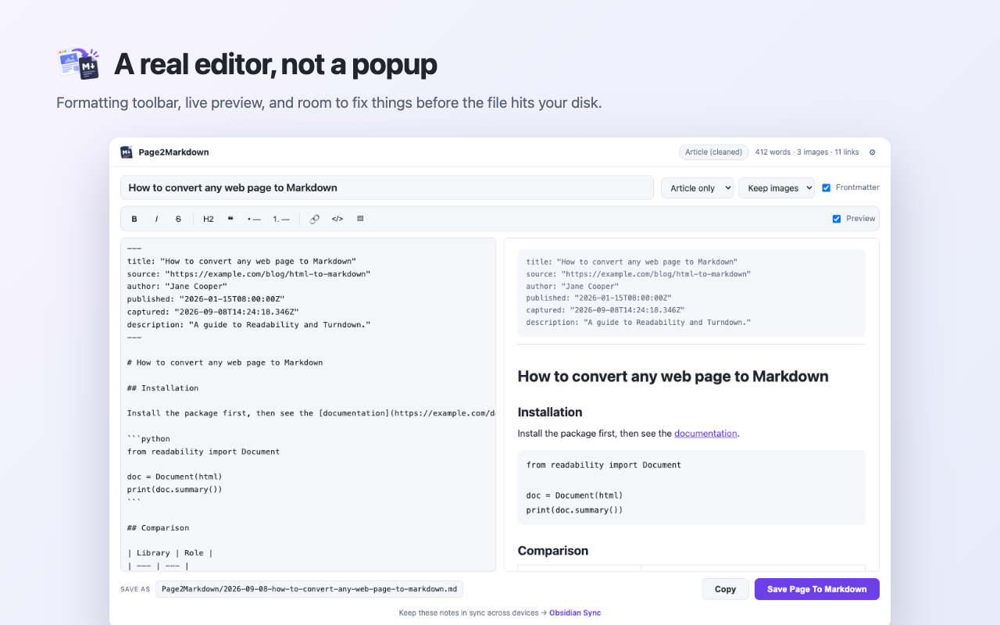

# Page2Markdown — save any web page as Markdown

[](https://chromewebstore.google.com/detail/page2markdown/knlheklmhjhcgpdccgfapfkikddmdgbo)
[](https://chromewebstore.google.com/detail/page2markdown/knlheklmhjhcgpdccgfapfkikddmdgbo)
[](LICENSE)
[](tsconfig.json)
[](#tests)

A Chrome extension (Manifest V3) — a **web clipper** that turns the page you are reading, or just the part you highlighted, into a clean **Markdown** file with **YAML frontmatter**, ready for **Obsidian**, Logseq, or any plain notes folder.

### [→ Install from the Chrome Web Store](https://chromewebstore.google.com/detail/page2markdown/knlheklmhjhcgpdccgfapfkikddmdgbo)

**[Website](https://phuthuycoding.github.io/Page2Markdown/)** · _[Tiếng Việt](README.vi.md)_

## What you get

- **Readable output, not a dump.** Navigation, ads, and sidebars stripped by [Readability](https://github.com/mozilla/readability); the HTML converted by [Turndown](https://github.com/mixmark-io/turndown).
- **Frontmatter that fits your vault.** Title, source URL, author, publication date, capture time, description, tags — pick which fields appear.
- **Markdown that survives.** GFM tables, fenced code blocks that keep their language, nested lists at the right indent, image captions, absolute URLs.
- **An editor, not a popup.** Formatting toolbar and live preview, so you fix things before the file lands on disk.
- **Nothing leaves your machine.** No server, no account, no analytics, no tracking.



## How it works

### Three ways in, one destination

| Entry point                             | Use it when                          |
| --------------------------------------- | ------------------------------------ |
| Toolbar icon                            | Default                              |
| `Cmd/Ctrl + Shift + M`                  | You don't want to leave the keyboard |
| Right click → **Save Page To Markdown** | You already highlighted a passage    |

All three open an **editor in its own tab**: formatting toolbar, Markdown source, live preview beside it. There is no popup — a popup that lives four seconds is not enough room to fix anything properly.

### Data flow

```
User asks for a capture (icon / shortcut / menu)
   │
   ├─ Chrome grants activeTab for that tab, for that moment only
   ▼
service worker ── ping the tab: is the content script already there?
   │                └─ no → inject src/content/extractor.js
   ▼
extractor (runs in the page) ── picks a source, in order:
   │   1. Current selection      → take exactly that
   │   2. Readability            → strip nav, ads, sidebars
   │   3. <main>/<article>/<body> → when Readability finds no article
   │
   ├─ clean the DOM: drop script/style/form, rewrite links and images to
   │   absolute URLs, recover lazy-loaded image sources, stamp code languages
   ├─ Turndown → Markdown (GFM tables, fenced code with language, tight lists)
   ▼
service worker ── save a draft to storage.local, open editor?draft=<id>
   ▼
editor ── frontmatter + title + body, fully editable
   └─ Copy or Save → draft deleted
```

### Why each step looks like that

- **Capture happens in the service worker, not in the editor.** `activeTab` only lives for the moment the user asked; the editor is a different tab with no rights over the original page. So the content has to be captured before the editor opens.
- **Handover goes through `storage.local`, not the URL.** An article is far longer than any address limit. Drafts older than 24 hours are purged.
- **Injected on demand, never declared as a static content script.** The extension asks only for `activeTab`, so it can read nothing until you ask, and costs nothing on pages you never save.
- **Ping before injecting.** Capturing the same page twice skips reloading a 52 KB bundle.
- **Readability first, page body second.** Readability filters beautifully but gives up on pages that aren't articles; falling back to `<main>` then `<body>` means it never hands you an empty file.
- **Preview renders inside a sandboxed `<iframe>`.** The content comes from an untrusted page and extension pages hold `chrome.*` privileges — XSS there is not an option.
- **Editing the title only rebuilds the header.** The frontmatter block and the H1 are replaced; anything you typed in the body is left alone.

## Install

**[Install from the Chrome Web Store](https://chromewebstore.google.com/detail/page2markdown/knlheklmhjhcgpdccgfapfkikddmdgbo)** — that is all most people need.

To build it yourself:

```bash
bun install
bun run build
```

Open `chrome://extensions`, enable **Developer mode**, choose **Load unpacked**, and select the `dist` folder.

While developing, `bun run dev` rebuilds on change — reload the extension to pick it up.

## Tests

```bash
bun run check      # typecheck + lint + unit tests + build
bun run test:e2e   # drives a real Chrome against the built extension
```

- `tests/extract.test.ts` — extraction against a real DOM (jsdom): metadata, code blocks keeping their language, absolute URLs, GFM tables, lazy images, nested lists, empty pages.
- `tests/filename.test.ts` — slugs from Vietnamese text, forbidden characters, subfolders, path traversal.
- `tests/markdown.test.ts` — YAML frontmatter surviving titles full of quotes and colons.
- `tests/markdown-commands.test.ts` — every toolbar button, including pressing it twice to remove formatting.
- `tests/config.test.ts` — when the welcome page opens, donate button configuration.
- `tests/e2e/` — the extension loads, menus register, settings persist, downloads complete, the editor builds a draft and saves what you actually edited.

One thing the e2e suite deliberately does **not** cover: the injection path itself. The extension only asks for `activeTab`, and Chrome grants that solely on a genuine user gesture — there is no legitimate way to fake one from outside. Extraction is covered by the jsdom tests instead.

## Layout

```
src/
  background/service-worker.ts   icon, shortcut, context menu, welcome page
  config/index.ts                defaults and shared constants
  content/
    extractor.ts                 injected entry, listens for messages
    extract.ts                   orchestration: pick source → clean → Turndown
    dom-cleaner.ts               absolute URLs, noise removal, code language
    turndown-factory.ts          Turndown configuration and custom rules
    page-meta.ts                 page metadata and current selection
  editor/
    editor.ts                    bootstrap: read draft, wire the controls
    markdown-commands.ts         formatting commands, pure string functions
    preview.ts                   render to HTML for the sandboxed iframe
  options/                       settings page
  services/                      settings / capture / download / draft
  types/                         shared types
  utils/                         filenames, frontmatter
```

## Settings

Click ⚙ in the top right of the editor.

- **Content**: scope (article / whole page), images (keep / alt text only / drop), keep or strip hyperlinks.
- **Frontmatter**: toggle it, pick fields (`title`, `source`, `author`, `published`, `captured`, `description`, `site`, `tags`), default tags, and whether to add the title as an `#` heading.
- **File**: filename template with `{title}` `{slug}` `{domain}` `{date}` `{time}` `{timestamp}` — a `/` creates a subfolder; destination folder inside Downloads; ask where to save each time.
- **Markdown style**: ATX or Setext headings, bullet marker, fenced or indented code blocks.

Inside the editor, changing **scope** or **images** only affects your next capture — both decide how HTML becomes Markdown, and that already happened before the tab opened.

## How it compares

|                                  | Page2Markdown           | Copy & paste | Print to PDF |
| -------------------------------- | ----------------------- | ------------ | ------------ |
| Keeps code blocks with language  | ✅                      | ❌           | ❌           |
| GFM tables                       | ✅                      | partly       | ❌           |
| Source URL and author recorded   | ✅                      | ❌           | ❌           |
| Editable before saving           | ✅                      | ✅           | ❌           |
| Plain text you can grep and diff | ✅                      | ✅           | ❌           |
| Works offline afterwards         | text yes, images by URL | ✅           | ✅           |

## Known limits

- **System pages are off limits**: `chrome://`, the Chrome Web Store, PDF viewer. The extension says so plainly instead of saving an empty file.
- **Lazy-loaded content**: only what has rendered when you capture. Infinite-scroll pages need scrolling first.
- **Images are referenced by URL**, not downloaded. Images behind a login or hotlink protection will break offline.
- **`file://` URLs** need "Allow access to file URLs" enabled manually on the extensions page.

## Privacy

No server, no account, no analytics, no tracking. The extension reads a page only when you ask, and only the page you are on. Captured text is held in local storage just long enough for the editor tab to pick it up, then deleted. See the [privacy policy](https://phuthuycoding.github.io/Page2Markdown/privacy.html).

## Contributing

Issues and pull requests are welcome — see [CONTRIBUTING.md](CONTRIBUTING.md) for the setup, the
commit convention, and what reviewers look for. By taking part you agree to the
[Code of Conduct](CODE_OF_CONDUCT.md). Found a security problem? Please read
[SECURITY.md](SECURITY.md) first — do not open a public issue.

```bash
bun install        # installs the git hooks too
bun run check      # format + typecheck + lint + tests + build
```

## License

[MIT](LICENSE).

Built on [@mozilla/readability](https://github.com/mozilla/readability), [Turndown](https://github.com/mixmark-io/turndown), and [marked](https://github.com/markedjs/marked).
